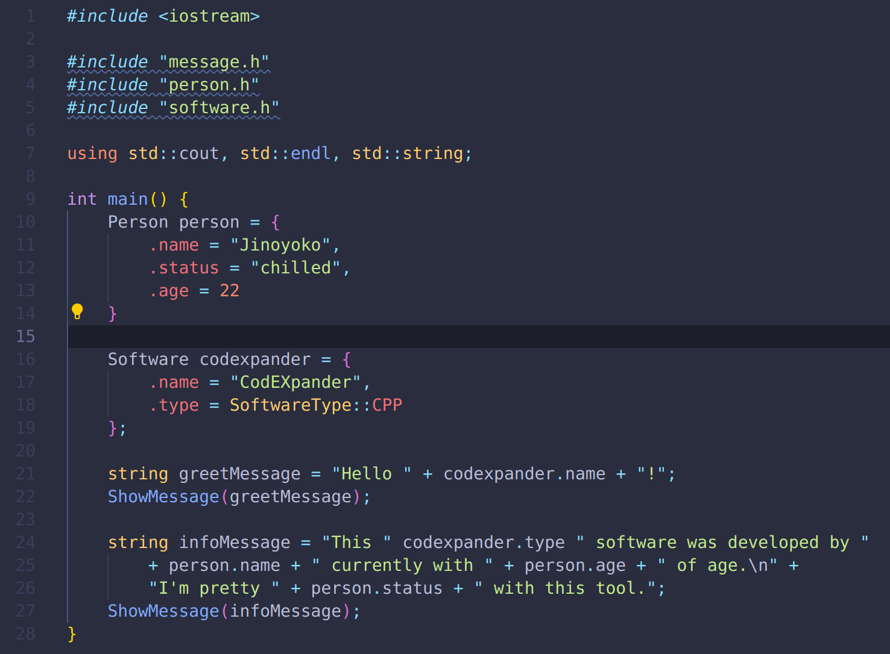
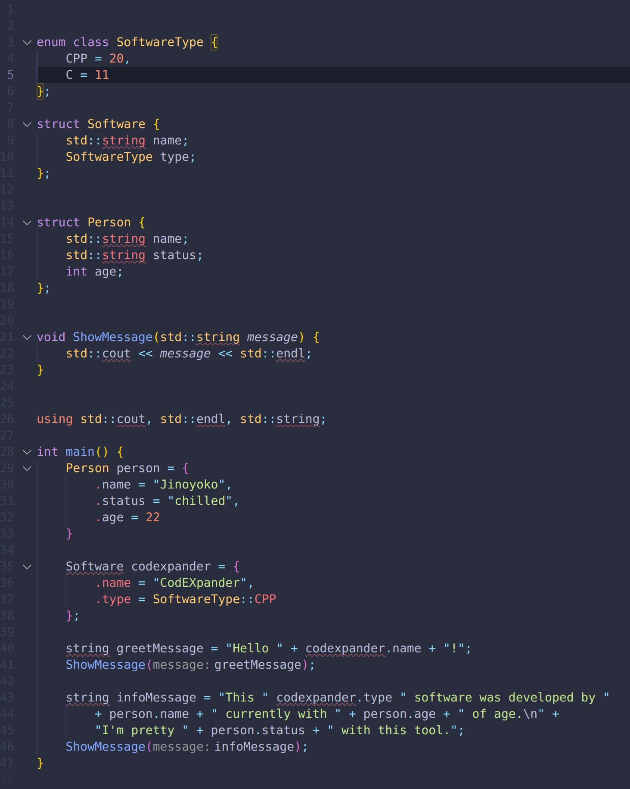

# CodEXpander
<span>
    
    
    
    
    
    
</span>
<br></br>

<span>
    
    
</span>

## Program Usage
This tool expands header definitions in source and haeder ```#include``` macro statements.
It reads a specified file or directory with files and creates a summarized file to view the current order of definitons of classes, functions, types and more.
<br></br>

**Program usage**
```sh
codexpander --source_file=<sourcefile>, --working_dir=<workindir> --output_file=<outputfile>
```
<br>

>**source_file**: the source file that should be expanded by the containing header includes

> **working_dir**: the directory where the program will look for header includes. Within the specified directory it will look for a **include** directory and searches for all included header files.

> **output_file**: the directory where the program will look for header includes. Within the specified directory it will look for a **include** directory and searches for all included header files.

<br>

## Background
When programming in C/C++ the way how you make functions, classed and more available for other source and header files, is via including header files with their definitions. The implementation of those are usually made in designated source files. When working with header files ```#include``` statements this file to be included could also contain a ```#include``` statements, which can create many layers of copying the content of those specified header files. When a error occours regarding a definition, it can get really difficult to find the exact error casue in one of those displayed files from the compiler program. In order to make the way how C\C++ extracts code segments easier, this tool should give you a better overview where definitions are not at the right places in the found files.
<br></br>

## Building from source - Linux

### Build requirements

<span>
    
    
</span>
<br></br>

**Build the projects in the root directory with make:**
```sh
make build
```
<br>

**Install the application**
```sh
make install
```
<br>

**Uninstall the application**
```sh
make uninstall
```
<br>

## Windows
🚫 **Currently not supported**
<br></br>

## Further notices
This is more a fun project to see what can become of the simple idea of resolving header include dependencies into a expanded simple source file. There is no concrete goal of what the software should look like at the end and if it seems to be that useful.